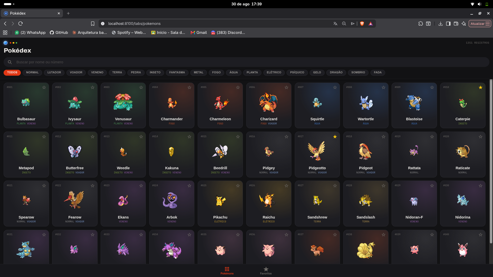
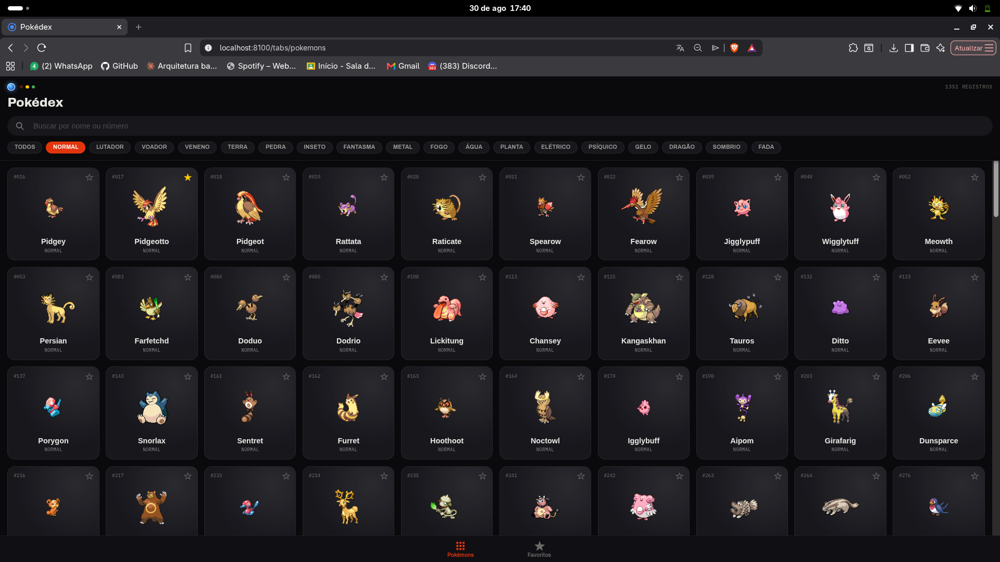
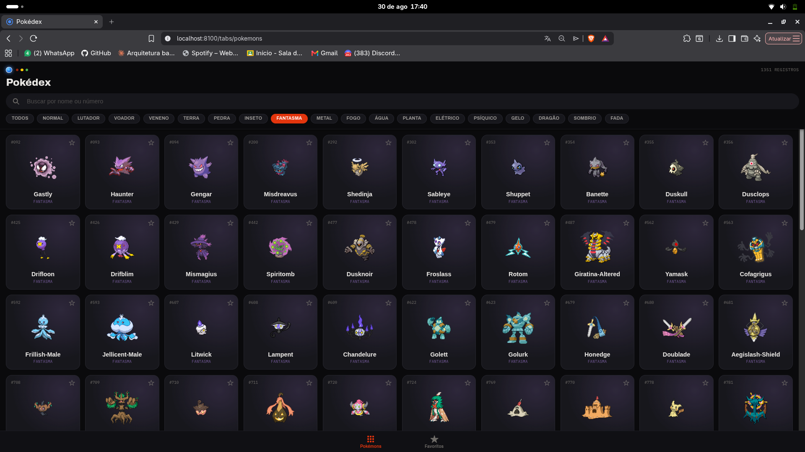
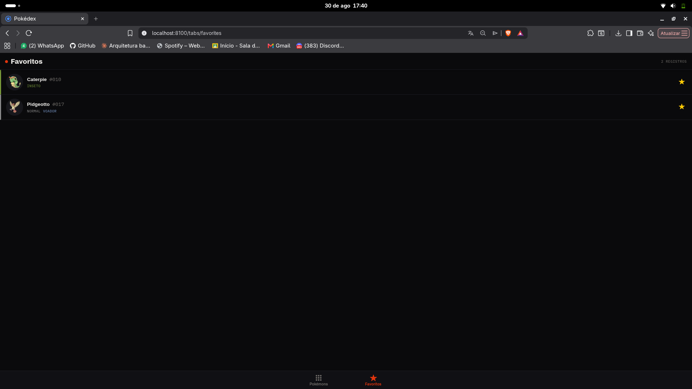
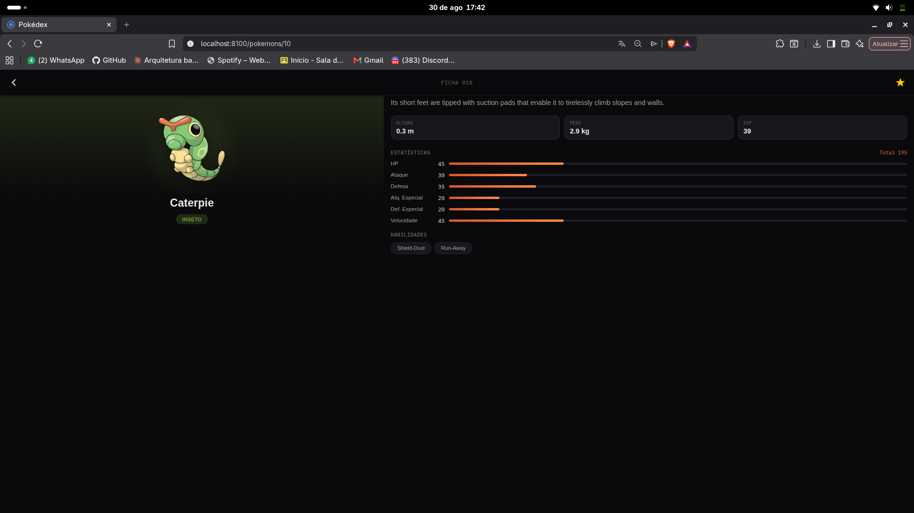

# Pokédex App

Aplicativo mobile-first construído com Ionic + Angular, consumindo a [PokeAPI](https://pokeapi.co/)
para listar, buscar, favoritar e detalhar Pokémon.

## Como rodar

```bash
npm install
npm start        # abre em http://localhost:4200
```

Ou via Ionic CLI, pra testar em emulador/dispositivo:

```bash
npx ionic serve
```

Rodar os testes e o lint:

```bash
npm test
npm run lint
```

## Funcionalidades

- Listagem paginada de Pokémon (nome + imagem), com scroll infinito
- Busca por nome, com cache local (a PokeAPI não tem busca parcial por nome)
- Filtro por tipo (chips), com aura/cor por tipo em toda a interface
- Favoritar direto na lista ou na tela de detalhes, persistido em `localStorage`
- Tela de detalhes com imagem, descrição, altura, peso, exp. base, tipos, habilidades e estatísticas base
- Tela de Favoritos
- Layout adaptado à orientação do dispositivo (retrato/paisagem)
- Notificação via webhook (webhook.site) sempre que um Pokémon é favoritado/desfavoritado

## Como funciona

Ao abrir o app, a aba **Pokémons** já mostra nome e imagem de cada Pokémon num grid, carregado aos
poucos conforme você rola a tela. Dá pra buscar por nome na barra de busca ou filtrar por tipo
pelos chips logo abaixo — cada tipo tem sua própria cor, que também aparece como um brilho sutil
atrás da imagem nos cards e na tela de detalhes.

Tocar num card leva pra tela de **Detalhes**: imagem, descrição, altura, peso, experiência base,
tipos, habilidades e as 6 estatísticas base. A estrela favorita o Pokémon direto na lista ou no
detalhe; favoritos ficam salvos no aparelho e aparecem na aba **Favoritos**. Cada vez que você
favorita ou desfavorita, o app também dispara uma notificação assíncrona pra um serviço externo
(webhook.site), simulando uma integração com outro sistema — isso nunca trava o favoritar local se
falhar. O layout se adapta à orientação do aparelho (retrato/paisagem) tanto na lista quanto no
detalhe.

## Como foi feito

O projeto foi construído de forma incremental: cada parte (modelos, serviços, cada tela, busca,
filtro por tipo, webhook, responsividade, testes) virou um commit isolado e testável, com Pull
Request próprio no GitHub — o histórico completo está documentado em
[`docs/PROGRESSO.md`](docs/PROGRESSO.md).

A arquitetura usa injeção de dependência: um único serviço (`PokeApiService`) concentra todo
acesso HTTP à PokeAPI, então nenhuma tela conversa direto com a API. `FavoritesService` mantém o
estado dos favoritos de forma reativa (`Observable`) e persiste em `localStorage`; `WebhookService`
cuida só da notificação externa, sem que as telas precisem saber que ele existe.

O visual partiu de uma referência de design (tema escuro, identidade visual por tipo de Pokémon,
tipografia Archivo + IBM Plex Mono) implementada tela por tela — grid da listagem, ficha de
detalhes com aura e barras de estatística, e a lista de favoritos em formato de fichas. Testes
unitários cobrem os três serviços centrais (`PokeApiService`, `FavoritesService`,
`WebhookService`).

## Stack

Ionic 8 + Angular 22 (standalone components, zoneless), RxJS, Vitest para testes unitários.

Mais detalhes de arquitetura em [`docs/ARQUITETURA.md`](docs/ARQUITETURA.md) e o histórico de
entregas em [`docs/PROGRESSO.md`](docs/PROGRESSO.md).

## Sobre as decisões do projeto

Optei por duas abas (Pokémons e Favoritos) mais uma tela de detalhes empilhada por cima, evitando
criar uma terceira seção artificial só para preencher espaço. A tela de listagem já abre mostrando
nome e imagem de cada Pokémon, com um cabeçalho decorativo que remete ao visual de uma Pokédex sem
virar uma tela separada. Toda comunicação com a PokeAPI passa por um único serviço injetável, então
nenhuma tela conversa direto com HTTP. A busca por nome usa um cache local da lista completa,
carregado uma única vez, porque a API não oferece busca parcial e uma requisição a cada tecla
digitada seria desnecessário. Os favoritos vivem em um serviço reativo com persistência em
`localStorage`, e cada alteração dispara uma notificação para um endpoint externo via
[webhook.site](https://webhook.site) — a PokeAPI não tem webhooks reais, então essa é uma
demonstração do conceito. Layout e grid se adaptam à orientação do dispositivo tanto na listagem
quanto no detalhe. Os três serviços centrais têm testes unitários cobrindo o comportamento
principal e casos de erro. O histórico de commits foi mantido pequeno e sequencial, cada um
isolado e testável, com um Pull Request correspondente no GitHub para cada entrega.

## Prints e vídeo

| Listagem | Filtro por tipo (Normal) | Filtro por tipo (Fantasma) |
|---|---|---|
|  |  |  |

| Favoritos | Detalhes |
|---|---|
|  |  |

Vídeo curto mostrando o app rodando (listagem, busca, filtro por tipo, favoritar, detalhes):

<video src="docs/screenshots/demo.mp4" controls width="360">
  Seu navegador não exibe vídeo embutido — baixe/abra <a href="docs/screenshots/demo.mp4">docs/screenshots/demo.mp4</a> diretamente.
</video>
